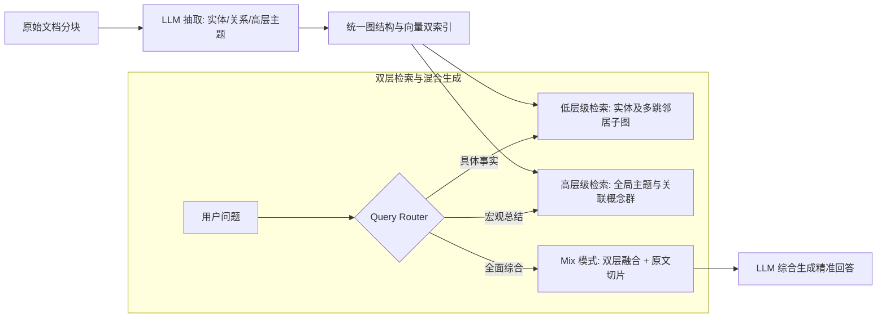

---
tags:
  - ai-tool
  - open-source
  - status/adopted
category: RAG-and-Data
github: https://github.com/HKUDS/LightRAG
stars: "23k+"
license: MIT
date_added: 2026-09-22
---

# 📦 LightRAG

> **一句话简介**：香港大学数据智能实验室（HKUDS）开源的轻量级检索增强生成框架，提出“双层知识图谱检索（Dual-Level Retrieval）”与增量图谱更新机制，在大幅降低大模型计算开销的前提下超越传统向量 RAG 与重型 GraphRAG。

## 📌 基本信息

| 属性 | 内容 |
| :--- | :--- |
| **仓库地址** | [GitHub: HKUDS/LightRAG](https://github.com/HKUDS/LightRAG) |
| **出品方** | 香港大学数据智能实验室 (HKU Data Intelligence Lab) |
| **核心特点** | 双层检索（实体级 + 主题级）、增量索引更新、极低 Token 消耗 |
| **支持图存储** | NetworkX, Neo4j, NanoVectorDB, Qdrant, Milvus 等 |
| **关联实践** | [[双层图谱增强检索：基于 LightRAG 的轻量化 GraphRAG 架构实践]], [[Graphify]], [[RAG 生产环境优化：多路召回与 Rerank 最佳实践]] |

---

## 🚀 核心架构与创新亮点

传统的 Naive RAG（基于分块与稠密向量相似度）与微软经典的 GraphRAG 存在各自的严重瓶颈：
- **Naive RAG 的局限**：文本切块打碎了长程关联与实体依赖，无法回答需要跨文档关系推理或全局主题总结的问题（如“分析该领域近年来的演进脉络”）。
- **传统 GraphRAG 的困境**：微软 GraphRAG 依赖层次化社群发现算法（Leiden）并需要为每个社群调用 LLM 生成摘要，构建成本高昂（一本书常需数十美元），且**不支持低成本增量更新**（新增一篇文档往往需要全局重算）。

**LightRAG 的突破性设计**：



1. **双层检索架构（Dual-Level Retrieval）**：
   - **低层级检索（Low-Level）**：关注具体实体及其 1~2 跳直接关系，精准回答细粒度事实型问题（如“系统 A 与组件 B 的交互协议是什么？”）。
   - **高层级检索（High-Level）**：关注更高维度的全局主题（Thematic Topics）与概念集群，高效解答宏观归纳型问题（如“过去三个月系统有哪些架构演进？”）。
   - **融合模式（Mix Mode）**：将低层级实体关系与高层级概念结合原文块共同送入模型，兼顾局部细节与全局视野。
2. **高效无缝增量更新（Incremental Update）**：
   - 新增文档时，直接抽取新实体并增量合并到现有图网络中，无需推倒全图重新执行聚类与社群摘要，极大降低企业知识库维护成本。
3. **极低的 Token 与时间成本**：
   - 相比于传统 GraphRAG 复杂的递归社群摘要生成，LightRAG 将索引构建成本压缩了近 90% 以上，响应速度快数倍。

---

## 🛠️ 快速上手与配置

### 1. 安装
```bash
pip install lightrag-hku
```

### 2. 完整初始化与检索示例
```python
import os
from lightrag import LightRAG, QueryParam
from lightrag.llm import openai_complete_if_cache, openai_embedding
from lightrag.utils import EmbeddingFunc

WORKING_DIR = "./lightrag_storage"
if not os.path.exists(WORKING_DIR):
    os.mkdir(WORKING_DIR)

# 1. 初始化 LightRAG 实例
rag = LightRAG(
    working_dir=WORKING_DIR,
    llm_model_func=openai_complete_if_cache,
    llm_model_name="gpt-4o-mini",
    embedding_func=EmbeddingFunc(
        embedding_dim=1536,
        max_token_size=8192,
        func=lambda texts: openai_embedding(texts, model="text-embedding-3-small")
    )
)

# 2. 增量导入知识库文档
sample_text = """
Antigravity 是下一代智能体结对开发工作台。它通过 MCP 协议与外界工具交互，
并采用 Dataview 构建动态双向链接知识库。LightRAG 作为其 RAG 核心组件，
与 Langfuse 可观测性平台相互协同，保障 Agent 的上下文召回与全链路追踪。
"""
rag.insert(sample_text)

# 3. 执行双层混合检索（Mix 模式）
result = rag.query(
    "Antigravity 的技术组件之间是如何协同工作的？",
    param=QueryParam(mode="mix") # 候选模式: local, global, hybrid, mix
)

print("生成结果：\n", result)
```

---

## 💡 工程实战点评与适用场景

- **推荐使用场景**：
  - 复杂垂直领域知识库（医药、法律、企业代码库、技术规范），实体间关系交织且需要兼顾全局推理。
  - 经常有增量新文档写入的高频迭代业务场景。
- **潜在不足 / 局限性**：
  - 依赖实体抽取阶段的 Prompt 质量，若领域专有名词复杂，需定制领域 Prompt 或 Few-Shot 样本以保证抽取纯净度。
- **个人评估结论**：**建议引入（status/adopted）**。是目前平衡知识图谱精度与向量检索开销最优雅的开源解决方案。
