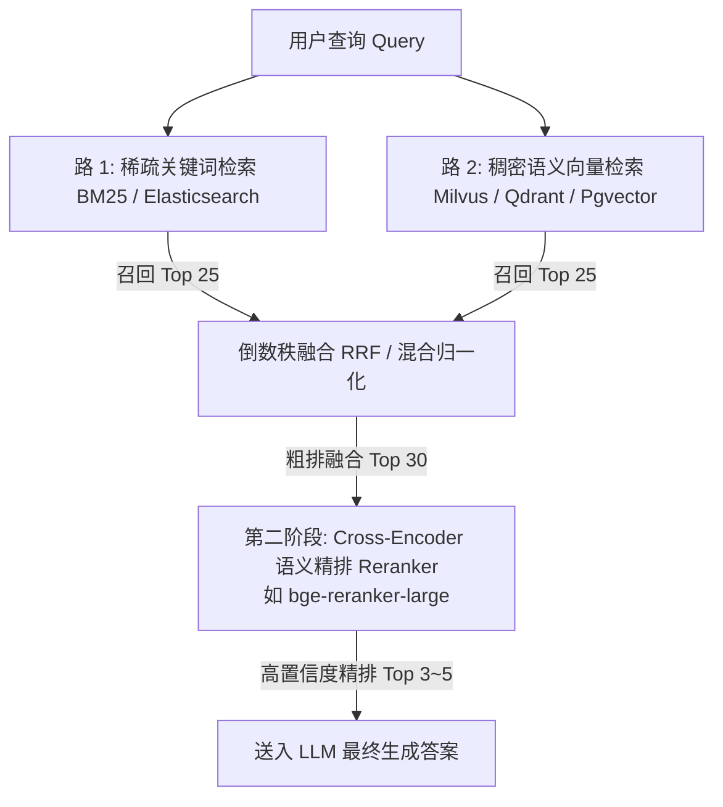

---
tags:
  - ai-practice
  - engineering
  - rag
domain: RAG调优
difficulty: 进阶
date_added: 2026-09-21
---

# 💡 RAG 生产环境优化：多路召回与 Rerank 最佳实践

> **核心摘要**：纯向量检索已无法满足高精度企业 RAG 诉求。通过“关键词稀疏检索 (BM25) + 稠密语义检索 (Dense Vector) + 倒数秩融合 (RRF) + 交叉编码器 (Reranker)”，构建高命中、低幻觉的两阶段精准检索管道。

---

## 🎯 业务痛点：为什么“纯向量检索”在生产中频频翻车？

在 Demo 阶段，基于 OpenAI 或开源 Embedding 的向量检索表现惊艳，但一进入企业生产环境，用户常常抱怨“搜不到”或“答非所问”：
1. **专有名词 / 精确匹配极差**：
   - 比如检索特定产品编码 `Model-AX900-Rev2`、身份证号、股票代码、特定函数名 `get_user_by_uuid()`，向量模型往往将相似格式的其他字符串混淆，召回错误。
2. **长文本语义稀释**：
   - 当一段文字包含多个话题时，Dense 向量被“平均化”，丢失核心特征细节。
3. **分值不可靠（Top-K 冗余与噪声）**：
   - 余弦相似度为 0.75 的文本块，可能是强相关，也可能只是语法结构相似的无关废话。如果一股脑把 Top 5 喂给 LLM，会引发大模型严重的“中间迷失（Lost in the middle）”和幻觉。

---

## 🏗️ 架构设计：两阶段检索管道 (Two-Stage Pipeline)

生产级高可用检索标准架构分为两个核心阶段：



### 关键步骤解析：
1. **多路并行初筛（Recall Stage）**：
   - **BM25 路**：专治型号、错误代码、精确词；
   - **Dense 向量路**：专治口语化提问、同义词改写、跨语言理解；
2. **粗排打分融合（RRF - Reciprocal Rank Fusion）**：
   - 不同算法返回的得分范围完全不同（BM25 分值可能 0~100+，Cosine 相似度 0~1）。
   - RRF 不看原始分数，只看**相对排名（Rank）**：
     $$\text{RRF\_Score}(d) = \sum_{m \in M} \frac{1}{k + r_m(d)}$$
     *(常量 $k$ 通常取 60)*
3. **精排重打分（Rerank Stage）**：
   - 传统 Embedding 属于 **Bi-Encoder（双塔模型）**：文档和问题是分开编码的，无法捕获词与词之间的交互；
   - Reranker 属于 **Cross-Encoder（单塔交叉编码）**：将 `[Query, Document]` 拼接在一起，做全注意力（Full Self-Attention）计算，能极精准识别句子间的逻辑蕴含关系。

---

## 💻 关键实现：基于 RRF 与 Reranker 的混合检索代码

```python
from typing import List, Dict
import numpy as np

def reciprocal_rank_fusion(bm25_results: List[str], vector_results: List[str], k: int = 60) -> List[Dict]:
    """
    RRF 倒数秩融合算法
    :param bm25_results: 关键词召回的文档唯一 ID 列表（按相关度从高到低）
    :param vector_results: 向量召回的文档唯一 ID 列表（按相关度从高到低）
    :param k: 平滑因子，常取 60
    """
    scores = {}
    
    # 计算 BM25 排名得分
    for rank, doc_id in enumerate(bm25_results):
        scores[doc_id] = scores.get(doc_id, 0.0) + (1.0 / (k + (rank + 1)))
        
    # 计算 向量 排名得分
    for rank, doc_id in enumerate(vector_results):
        scores[doc_id] = scores.get(doc_id, 0.0) + (1.0 / (k + (rank + 1)))
        
    # 按综合得分降序排序
    sorted_docs = sorted(scores.items(), key=lambda x: x[1], reverse=True)
    return [{"doc_id": doc_id, "rrf_score": score} for doc_id, score in sorted_docs]
```

### 使用 BGE-Reranker 对候选集精排：
```python
from sentence_transformers import CrossEncoder

# 加载轻量级高精度重排序模型
reranker = CrossEncoder('BAAI/bge-reranker-large')

query = "如何配置 vLLM 的多卡分布式推理？"
candidate_texts = [
    "vLLM 支持 tensor-parallel-size 设置多卡并行...",
    "Docker 安装指南与常规环境排错手册...",
    "使用 Ray 运行分布式训练的相关最佳实践..."
]

# 拼接成 (Query, Passage) 对
pairs = [[query, text] for text in candidate_texts]

# 预测深度语义相关性打分 (直接输出 sigmoid 归一化后的得分)
scores = reranker.predict(pairs)

# 过滤低于阈值（如 0.35）的无关候选，截取 Top 3
ranked_candidates = sorted(zip(candidate_texts, scores), key=lambda x: x[1], reverse=True)
final_contexts = [text for text, score in ranked_candidates if score > 0.35][:3]
```

---

## ⚠️ 生产环境踩坑与避坑指南

1. **Reranker 延迟问题**：
   - Cross-Encoder 的计算开销远大于双塔向量。
   - **避坑准则**：千万不要对库里所有的上万个文档跑 Reranker！必须先通过 BM25 + 向量初筛出 **前 20~30 个候选**，再让 Reranker 参与精排，耗时可控制在 30~50ms 以内。
2. **Chunk 分块大小与上下文切分**：
   - 纯小块（如 200 Token）利于检索，但丢上下文；大块（如 1500 Token）上下文完整，但向量表示弥散。
   - **最佳方案**：采用 **“父子块索引（Parent-Child / Hierarchical Chunking）”** 或 **“Small-to-Big Retrieval”**——用小块（256 Token）做向量和重排检索，检索命中后，将对应的小块扩展到其所属的大块父段落（1024 Token）送给大模型。
3. **阈值过滤机制**：
   - 务必设定 Rerank 相似度保底阈值（如 0.3~0.4）。若所有召回结果打分都极低，说明知识库无匹配内容，直接回复“知识库暂无相关记录”，防止大模型强行瞎编。

---

## 🔗 关联阅读
- 关联项目：[[vLLM]], [[LiteLLM]]
- 关联日报：[[2026-09-21-AI-Digest]]
