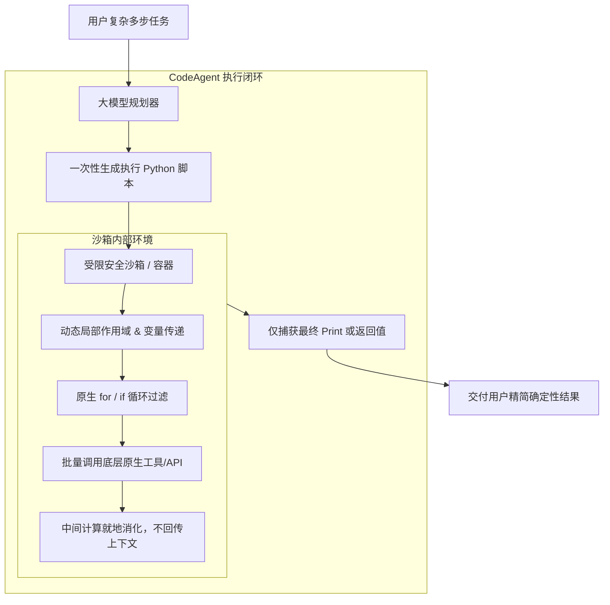

---
tags:
  - ai-practice
  - engineering
  - agent-architecture
  - code-agent
domain: Agent设计与交互范式
difficulty: 中等
date_added: 2026-09-22
---

# 💡 代码驱动智能体：基于 CodeAgent 的复杂多步任务执行范式

> **核心摘要**：传统的 JSON Tool Calling 机制在面对复杂多步骤、数据管道流转以及循环处理时面临严重的 Token 膨胀与高延迟瓶颈。本文探讨以 CodeAgent（智能体以 Python 代码块为操作语言）为核心的新型执行范式，分析其在减少往返轮次、支持原子逻辑编排与安全沙箱隔离上的工程落地实践。

---

## 🎯 业务痛点：为什么 JSON Tool Calling 开始遇到天花板？

在构建复杂智能体（如数据报表统计、批量文件审查、跨 API 管道集成）时，传统的 JSON Schema 机制暴露了明显的工程劣势：

1. **往返通信膨胀（Chatter & Round Trips）**：
   - 假设需要对 20 个接口返回的数据做过滤求和，传统 ReAct 模式需要大模型与环境发生至少 20 轮“生成 JSON -> 解析 -> 执行 -> 塞回消息历史 -> 再次生成”交互。
   - 导致 API 首字延迟和整体响应时间高达几十秒，同时每一轮都在重新计费更长的前缀上下文。
2. **缺乏流程控制与中间变量抽象**：
   - 自然语言和 JSON 很难原生表达条件分支（`if/else`）、循环迭代（`for/while`）以及临时变量暂存。大模型往往需要在上下文里手写长篇累赘的中间推导。
3. **数据格式转换的脆弱性**：
   - 工具 A 输出的数据若需要作为参数传入工具 B，传统方式依赖大模型在上下文里将数据“全文复述”一遍，极易引发幻觉或截断。

---

## 🏗️ 架构设计与解决方案

采用 **“以代码为动作语言（Code as Actions）”** 的架构模式：



### 核心机制对比：

| 维度 | 传统 JSON Tool Calling | 代码驱动 CodeAgent |
| :--- | :--- | :--- |
| **交互轮次** | 多步任务需 $N$ 次 LLM 往返调用 | 常见任务仅需 $1 \sim 2$ 次生成完整脚本 |
| **Token 消耗** | 中间数据反复放入对话历史，开销巨大 | 中间结果在内存变量中流转，消耗极低 |
| **逻辑表达能力** | 仅支持离散单步调用，无原生控制流 | 支持完整 Python 控制流、集合推导式与数学运算 |
| **执行延迟** | 受多次 LLM 推理延迟制约（秒级×N） | 单次推理 + 本地毫秒级解释执行 |

---

## 💻 关键实现与模式示例

以 [[smolagents]] 的受限解释器范式为例，展示如何在单次推理中完成批量数据的跨工具编排：

```python
from smolagents import CodeAgent, HfApiModel, tool
import json

# 1. 定义原子底层工具（返回结构化大批量数据）
@tool
def list_system_alerts(severity: str) -> str:
    """获取指定级别的系统监控告警列表。
    
    Args:
        severity: 告警级别，如 'critical', 'warning', 'info'
    """
    # 模拟真实监控系统返回的大量日志/指标字典
    data = [
        {"service": "auth-service", "metric": "cpu_util", "val": 94.2, "count": 5},
        {"service": "payment-api", "metric": "latency_p99", "val": 1820.0, "count": 12},
        {"service": "order-worker", "metric": "queue_lag", "val": 45.0, "count": 1},
    ]
    return json.dumps(data)

@tool
def notify_oncall(service_name: str, reason: str) -> str:
    """向值班工程师发送紧急通知。"""
    return f"已成功通知 {service_name} 负责组：{reason}"

# 2. 构建 CodeAgent
agent = CodeAgent(
    tools=[list_system_alerts, notify_oncall],
    model=HfApiModel("Qwen/Qwen2.5-Coder-32B-Instruct"),
    additional_authorized_imports=["json", "math"]
)

# 3. 执行任务
prompt = """
请审查所有的 'critical' 告警。
找出所有发生次数 count > 3 的服务，并将它们统一归纳，逐一调用通知工具通知值班负责人。
"""

agent.run(prompt)
```

大模型自主生成的执行代码（在沙箱内一气呵成）：
```python
import json

raw_alerts = list_system_alerts(severity="critical")
alerts = json.loads(raw_alerts)

notified_services = []
for alert in alerts:
    if alert["count"] > 3:
        service = alert["service"]
        reason = f"指标异常: {alert['metric']} 当前值 {alert['val']}，触发频次达到 {alert['count']} 次"
        res = notify_oncall(service_name=service, reason=reason)
        notified_services.append(service)

print(f"成功处置并通知了 {len(notified_services)} 个高危服务: {', '.join(notified_services)}")
```

---

## ⚠️ 生产环境关键避坑与安全边界

1. **绝对禁止无保护的 `exec()` / `eval()`**：
   - 必须使用语法树白名单限制的受限解释器（AST Interpreter，禁止导入 `os`, `sys`, `socket`, `subprocess` 等危险库）；
   - 企业敏感环境下，建议强制挂载到 Docker 隔离容器或 E2B / Modal 等轻量级 MicroVM 沙箱中执行。
2. **设置严格的死循环超时机制（Execution Timeout）**：
   - 模型生成的代码可能偶发死循环（如 `while True:`），沙箱执行器必须显式设置毫秒级/秒级超时（如 `timeout=5.0s`），并在超限时抛出中断。
3. **内存与变量泄露防护**：
   - 单次 Task 执行完成后立即销毁沙箱命名空间，防止历史临时变量跨会话污染。

---

## 🔗 关联项目与引用
- 核心工具卡片：[[smolagents]], [[FastMCP]]
- 状态机编排卡片：[[LangGraph]]
- 关联日报：[[2026-09-22-AI-Digest]]
