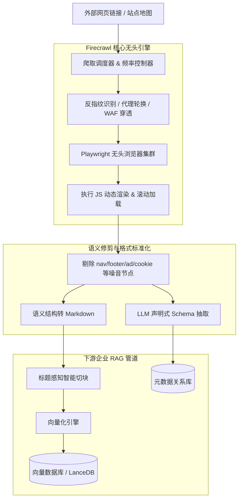

---
tags:
  - ai-practice
  - engineering
  - architecture
domain: RAG调优
difficulty: 中等
date_added: 2026-09-24
---

# 💡 企业级 RAG 外部数据源清洗：基于 Firecrawl 的反爬对抗与智能 Markdown 结构化抽取实践

> **核心摘要**：垃圾进，垃圾出（Garbage in, Garbage out）。RAG 知识库检索准确率的第一道关卡是数据源清洗。本文深入解析如何基于 Firecrawl 架构实现抗反爬、无头渲染与噪音剥离，将外部复杂动态网页转化为高质量、高语义密度的 LLM 友好 Markdown 与结构化知识片段。

---

## 🎯 业务/技术背景与痛点

在企业知识库、竞品情报雷达、行业投研与 Agent 自动化检索场景中，大量高价值知识沉淀在外部 Web 页面上。传统网页爬取方案（如 `requests` + `BeautifulSoup`、Scrapy）在对接现代 RAG 时遇到严重瓶颈：

1. **JS 动态渲染断流（SPA 盲区）**：
   - 现代官网和 SaaS 控制台大量采用 React/Vue/Next.js 等前端框架，直接 HTTP GET 只能拿到空的 `<div id="root"></div>`，正文内容完全丢失；
2. **反爬与机器人拦截（403 Cloudflare 阻断）**：
   - 传统爬虫频繁遇到 WAF、Cloudflare 盾拦截或 IP 速率限制，导致定时增量同步任务大面积失败；
3. **严重的内容噪音污染（Noise Contamination）**：
   - 原始 HTML 充斥着页眉导航、页脚版权、Cookie 同意弹窗、侧边栏广告推荐及无意义的 CSS 样式类名；
   - 若直接切分存入向量库，**高达 60% 以上的切片（Chunk）会被垃圾元数据污染**，严重稀释 Embedding 语义相似度，导致检索召回产生致命幻觉。

---

## 🏗️ 架构设计与解决方案

基于 Firecrawl 的高质量数据源清洗流水线划分为四大核心层级：**反爬调度调度层**、**无头渲染沙箱**、**语义树智能剪枝** 与 **结构化输出管线**：



### 核心清洗原则
1. **语义保留与噪音物理切除**：
   - 强制只保留正文树（Main Content），将 HTML 表格无损转化为 Markdown Table，图片转化为包含 Alt 文本的 Markdown 语法，超链接转为有上下文的锚文本；
2. **异步全站递归映射（Map & Crawl）**：
   - 避免无休止的网状盲爬，先调用 `/map` 抽取有效业务路由白名单，再通过批处理流水线并发抓取；
3. **抽取态与切块态的格式对齐**：
   - 保证产出的 Markdown 严格保留 `#`、`##` 级联标题，以便后续分块器（Chunker）执行**按章节分块（MarkdownHeaderTextSplitter）**，确保切片语义自闭环。

---

## 💻 关键代码实现：企业级网页知识入库流水线

```python
import os
import asyncio
from typing import List, Dict, Any
from pydantic import BaseModel, Field
from firecrawl import FirecrawlApp
import lancedb

# 1. 初始化 Firecrawl 客户端与本地向量库
firecrawl = FirecrawlApp(api_url="http://localhost:3002") # 本地自建实例
db = lancedb.connect("./data/rag_knowledge")

# 2. 定义业务抽取规范（如产品特性与更新日志）
class ReleaseNoteSchema(BaseModel):
    version: str = Field(description="版本号")
    release_date: str = Field(description="发布日期")
    highlights: List[str] = Field(description="核心功能更新要点")
    breaking_changes: List[str] = Field(description="不兼容变更项")

async def sync_external_docs_to_rag(target_domain: str) -> None:
    print(f"[*] 开始映射网站拓扑: {target_domain}")
    
    # 步骤 A: 探索全站有效文档 URL
    map_result = firecrawl.map_url(
        target_domain,
        params={"search": "docs", "limit": 20}
    )
    urls: List[str] = map_result.get("links", [])
    print(f"[+] 识别到 {len(urls)} 个相关文档页面")

    # 步骤 B: 批量抓取、渲染并清洗为纯净 Markdown
    for url in urls:
        try:
            scrape_data = firecrawl.scrape_url(
                url,
                params={
                    "formats": ["markdown", "extract"],
                    "onlyMainContent": True,
                    "waitFor": 1500, # 等待动态组件渲染
                    "extract": {
                        "schema": ReleaseNoteSchema.model_json_schema(),
                        "prompt": "提取该页面的软件版本、发布日期与核心特性变更"
                    }
                }
            )
            
            clean_markdown = scrape_data.get("markdown", "")
            extracted_json = scrape_data.get("extract", {})

            # 步骤 C: 质量校验（剔除短于 100 字符的无效/空白页）
            if len(clean_markdown.strip()) < 100:
                print(f"[!] 页面内容过短，跳过: {url}")
                continue

            print(f"[✔] 成功解析: {url} | 长度: {len(clean_markdown)} 字符")
            # 下游处理：送入向量化切块并入库
            # ...
        except Exception as e:
            print(f"[✘] 抓取失败: {url} | 原因: {e}")

if __name__ == "__main__":
    asyncio.run(sync_external_docs_to_rag("https://example-docs.com"))
```

---

## ⚠️ 生产环境踩坑与避坑指南

1. **无限循环路由与动态日历陷阱**：
   - **坑点**：某些网站的动态日历（`/calendar?month=1&year=2026...`）或搜索分页参数会导致爬虫深陷无限抓取死循环；
   - **避坑方案**：在 `crawl` 时配置严格的 `excludePaths` 正则，限制最大爬取深度（`maxDepth: 3`）与总抓取配额。
2. **SPA 单页应用滚动懒加载数据丢失**：
   - **坑点**：部分长文文档只有当用户滚动到视口下方时才通过网络拉取后续章节；
   - **避坑方案**：在 Firecrawl 的请求参数中启用滚动指令（`actions: [{"type": "scroll", "direction": "down"}]`），确保全文加载后再执行 DOM 清洗。
3. **字符集编码与乱码污染**：
   - **坑点**：国内某些政府或传统高校网站仍使用 `GBK` / `GB2312` 编码，导致转出的 Markdown 出现乱码；
   - **避坑方案**：Firecrawl 自带 chardet 自动编码探测，若部署自建 Docker 实例，应保持无头 Chromium 镜像的中文语言包（`fonts-wqy-zenhei`）预装齐全。

---

## 🔗 关联项目与引用
- 相关工具: [[Firecrawl]], [[LanceDB]], [[RAGFlow]]
- 相关实践: [[RAG 生产环境优化：多路召回与 Rerank 最佳实践]]
