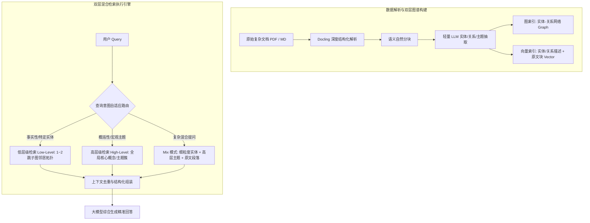

---
tags:
  - ai-practice
  - engineering
  - rag-architecture
  - graph-rag
domain: RAG调优与图谱增强
difficulty: 进阶
date_added: 2026-09-22
---

# 💡 双层图谱增强检索：基于 LightRAG 的轻量化 GraphRAG 架构实践

> **核心摘要**：传统稠密向量 RAG 受制于分块割裂，在面对跨文档实体关系跳跃与全局性主题归纳时极易出现严重幻觉与信息盲区；而重型 GraphRAG 因昂贵的社群聚类摘要成本和无法低成本增量更新在工业界举步维艰。本文深入解析基于 LightRAG 的“双层检索架构（Dual-Level Retrieval）”与增量图谱维护方案，展示如何在生产环境下低成本落地高精度 GraphRAG。

---

## 🎯 业务痛点与技术背景

在构建企业级专业知识库（如技术架构文档、金融审计、医疗规范或庞大代码库）时，传统的向量检索（Dense Vector Retrieval）面临三大致命顽疾：

1. **分块上下文撕裂（Chunk Fragmentation）**：
   - 文本被切分为 500~1000 Token 的片段后，跨章节甚至跨文档的实体间关系被物理斩断。模型只知其一不知其二，多跳推理（Multi-hop Reasoning）能力极弱。
2. **全局宏观总结失灵（Global Summary Blindness）**：
   - 当用户提出“总结整个系统的演进风险”或“梳理各模块的核心技术路线”等宏观问题时，向量相似度根本无法召回能够概括全局的 Chunk。
3. **传统 GraphRAG（如微软方案）难以工业化承受**：
   - 微软 GraphRAG 引入层次化社群发现算法（Leiden）并强制 LLM 为每个层级的社群生成长篇摘要，构建一本小规模语料即耗费数十美元，且**任何新增文档都要求全局重新聚类和重写摘要**，完全无法适应真实业务的高频更新需求。

---

## 🏗️ 架构设计与解决方案

为了兼顾“细粒度事实查找”与“宏观全局概括”，并彻底支持**低成本增量索引**，我们构建基于 LightRAG 的双层图谱增强检索流水线：



### 核心设计原则

1. **双层检索解耦（Dual-Level Granularity）**：
   - **Low-Level（局部微观实体层）**：提取具体 Named Entities 及其边连接（Nodes & Edges）。针对“A 服务的超时参数是多少”等问题，快速命中局部实体及直接关联邻居。
   - **High-Level（全局宏观抽象层）**：在抽取实体时同步提取高阶主题词（High-order Themes）。针对“系统主要解决哪些并发安全问题”等概括性查询，直接激活高层概念簇。
   - **Mix Mode 动态融合**：同时获取微观实体属性与宏观主题描述，利用 RRF（倒数排名融合）算法混合排序，提供全景上下文。
2. **增量无损更新（Incremental Indexing）**：
   - 新增文档入库时，抽取的新节点与新关系直接以增量 Upsert 形式合并到现有图网络中。不涉及全局图重构，单次插入成本等同于普通向量写入。

---

## 💻 关键工程实现代码

以下为在生产环境下利用 `LightRAG` 结合本地存储与缓存机制落地的完整实现：

```python
import os
import asyncio
from lightrag import LightRAG, QueryParam
from lightrag.llm import openai_complete_if_cache, openai_embedding
from lightrag.utils import EmbeddingFunc

class ProductionLightRAGService:
    def __init__(self, storage_dir: str = "./prod_lightrag_data"):
        self.storage_dir = storage_dir
        os.makedirs(storage_dir, exist_ok=True)
        
        # 1. 初始化引擎，启用本地 Cache 降低重复抽取 Token 成本
        self.rag = LightRAG(
            working_dir=self.storage_dir,
            llm_model_func=openai_complete_if_cache,
            llm_model_name="gpt-4o-mini",       # 抽取阶段选用性价比极高的高速模型
            embedding_func=EmbeddingFunc(
                embedding_dim=1536,
                max_token_size=8192,
                func=lambda texts: openai_embedding(texts, model="text-embedding-3-small")
            ),
            # 可配置底层为 Neo4j 或 Milvus，默认使用嵌入式 NetworkX + NanoVectorDB
        )

    def insert_documents(self, text_list: list[str]):
        """批量增量插入文档，自动抽取实体与关系并更新图结构"""
        for doc in text_list:
            if doc.strip():
                self.rag.insert(doc)
        print(f"成功增量写入 {len(text_list)} 篇文档到知识图谱！")

    def adaptive_query(self, query_text: str, query_type: str = "mix") -> str:
        """
        自适应查询入口:
        - mode='local': 聚焦实体与直接关联边 (精准定位具体事实)
        - mode='global': 聚焦全局宏观概念与高阶主题 (概念对比与概括)
        - mode='hybrid': 标准图谱检索 + 稠密向量搜索
        - mode='mix': 双层知识图谱 (低层+高层) 深度融合模式 (最强综合表现)
        """
        valid_modes = ["local", "global", "hybrid", "mix"]
        mode = query_type if query_type in valid_modes else "mix"
        
        response = self.rag.query(
            query_text,
            param=QueryParam(
                mode=mode,
                top_k=60,                   # 候选图节点与切片上限
                response_type="Multiple Paragraphs"
            )
        )
        return response

if __name__ == "__main__":
    service = ProductionLightRAGService()
    
    # 模拟新增技术规范
    tech_spec = """
    Antigravity 开发平台集成 MCP 协议服务，支持通过 FastMCP 编写轻量级工具服务器。
    在数据层，知识库基于 LightRAG 提供双层知识图谱检索能力，替代传统的单一向量 RAG。
    所有 Agent 的调用轨迹均通过 Langfuse 进行 Tracing 观测，并计算 Token 成本与延迟。
    """
    service.insert_documents([tech_spec])
    
    # 执行宏观与多跳综合查询
    ans = service.adaptive_query(
        "请说明 Antigravity 知识库的数据架构以及与其他系统组件的关联交互关系？",
        query_type="mix"
    )
    print("\n[LightRAG 检索回答]:\n", ans)
```

---

## ⚠️ 生产环境踩坑与避坑指南

### 1. 实体别名混乱与节点爆炸（Entity Aliasing & Node Explosion）
- **现象**：同一实体在不同文档中以缩写、全名、别称出现（例如“LightRAG”、“Light-RAG”、“轻量图检索库”），导致图谱中创建了三个孤立节点，关系断裂。
- **避坑方案**：
  - 在抽取的 Prompt 中注入标准实体词典（Entity Alias Dictionary）；
  - 在写入图之前增加一层轻量 Embedding 近邻聚类合并，对相似度高于 0.92 且拼写高度重合的实体执行 Node Merge 操作。

### 2. 抽取 Prompt 的领域调优防泛化丢失
- **现象**：默认的通用 Prompt 在处理专业领域（如金融衍生品、医学靶点、复杂类继承关系）时容易把关键业务名词识别为普通形容词。
- **避坑方案**：
  - 重写 LightRAG 的 `entity_extract_prompt`，针对企业私有领域注入 2~3 个最具代表性的 Few-Shot 示例，明确要求抽取的实体类别（如 `[Module]`, `[Interface]`, `[RiskFactor]`）。

### 3. 图存储选型与并发安全
- **现象**：默认自带的 NetworkX + 文件存储仅适用于单机或小规模 PoC；在多进程并发写入或生产分布式容器集群下会出现写锁冲突与内存膨胀。
- **避坑方案**：
  - 生产环境统一将图存储后端切换为 **Neo4j**（图拓扑与多跳查询）或 **NebulaGraph**，将向量部分外置给 **Qdrant** / **Milvus**，解耦计算与持久化存储。

---

## 🔗 关联项目与引用
- 相关开源工具：[[LightRAG]], [[Docling]], [[Graphify]]
- 关联实践设计：[[RAG 生产环境优化：多路召回与 Rerank 最佳实践]], [[基于代码知识图谱的代码大模型上下文增强：Graphify 实践]]
- 参考开源：[HKUDS/LightRAG GitHub 官方仓库](https://github.com/HKUDS/LightRAG)
