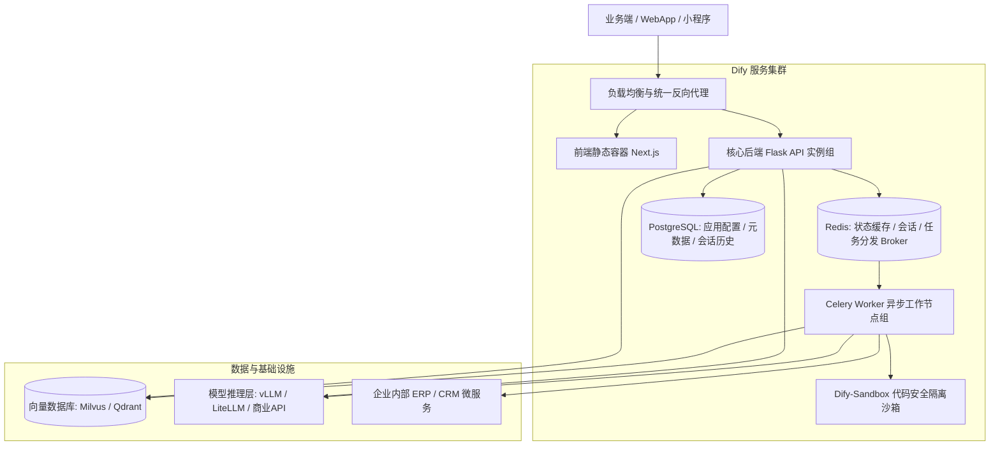
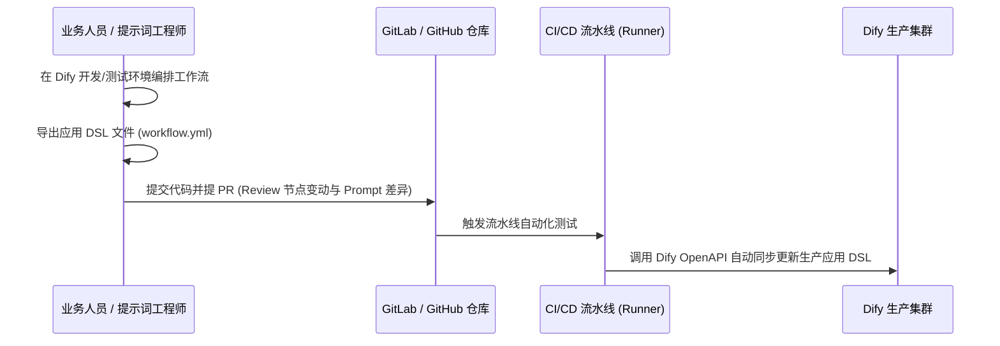

---
tags:
  - ai-practice
  - engineering
  - workflow
  - rag
  - agent-platform
domain: 智能体应用编排与工作流
difficulty: 中等
date_added: 2026-09-23
---

# 💡 基于 Dify 的企业级 Agent 工作流与 RAG 落地架构实践

> **核心摘要**：Dify 不仅是一个低代码界面，更是现代化企业 AI 中台的核心底座。本文系统拆解 Dify 生产环境高可用微服务架构、DSL GitOps 研发流水线，以及复杂业务工作流（意图路由、迭代批量处理、安全沙箱）的落地避坑经验。

---

## 🎯 企业落地挑战与破局

在企业推进大模型应用时，通常面临两大极端：
1. **纯代码死板**：每次 Prompt 调优或调整分支逻辑都要找后端改代码、重新打镜像发版，业务运营极慢；
2. **纯 SaaS 黑盒**：数据合规风险高，无法与企业自建权限系统、内部 ERP/CRM API 打通。

**Dify 的最佳工程定位**：
- **运营/业务侧**：在可视化界面快速调优 Prompt、配置工作流节点并在线调试；
- **研发侧**：通过 **DSL 纳管 + 暴露 RESTful API + 自定义插件扩展**，无缝嵌入既有微服务系统。

---

## 🏗️ 生产级微服务部署架构

在真实生产高并发场景下，单机 Docker Compose 往往会遭遇瓶颈。标准生产架构设计如下：

---

## 🔄 核心工程规范：DSL 与 GitOps 自动化发版

许多团队直接在生产环境 Dify 界面“改动即发布”，极易引发生产事故。成熟工程团队应推行 **DSL GitOps 规范**：

---

## 💻 典型复杂工作流编排设计模式

### 1. 意图分类器与动态多路分流 (Intent Routing Pattern)
针对复杂的企业智能客服，禁止将所有指令一股脑塞给同一个大模型。
- **Step 1（意图识别）**：使用低延迟小模型（如 Qwen2.5-7B 或 GPT-4o-mini）做快速分类，输出枚举值：`[查订单, 申请售后, 技术支持, 闲聊]`；
- **Step 2（IF/ELSE 分流）**：
  - 若为“查订单”：进入 HTTP 请求节点调用订单微服务；
  - 若为“技术支持”：进入知识库检索节点（RAG）做深入排查；
  - 若为“闲聊”：直接走轻量对话模型。

### 2. 迭代节点批处理与数据清洗 (Iteration & Code Sandbox)
当大模型一次性生成多个任务或需要处理长列表时：
- 使用 **代码节点（Python 3）** 将大模型的文本输出解析为标准化 JSON 数组；
- 连接 **迭代节点（Iteration）** 对列表内每个元素循环调用下级工具；
- 最终汇聚结果输出给前端，避免大模型长上下文输出截断。

---

## ⚠️ 生产环境关键避坑指南

1. **Celery Worker 任务积压与 OOM 隐患**：
   - RAG 批量上传大文件（如上百页 PDF）解析是非常消耗 CPU 和内存的。
   - **避坑方案**：在 Docker 配置中将 **Web API 节点与 Celery Worker 容器做物理隔离**，且 Worker 容器必须设置内存硬限制（如 `mem_limit: 4g`），避免文档解析爆显存导致 Web 界面假死。
2. **沙箱网络权限隔离 (Sandbox Security)**：
   - 默认的代码节点沙箱支持发起网络请求。如果内网存在敏感服务，需配置沙箱容器的 `ALLOWED_SYSCALLS` 与内网网段黑名单，防止 SSRF 漏洞。
3. **混合检索分值阈值校准**：
   - Dify 知识库混合检索默认权重若未调优，常导致语义相关但关键词不匹配的段落被过滤。
   - 建议在知识库设置中明确开启 **Rerank 模型**（如 `bge-reranker-large`），将阈值设定在 `0.35~0.45` 之间，兼顾准确率与召回覆盖率。

---

## 🔗 关联阅读
- 开源工具：[[Dify]], [[LangGraph]], [[LiteLLM]]
- 知识库导航：[[000-AI-Index]]
