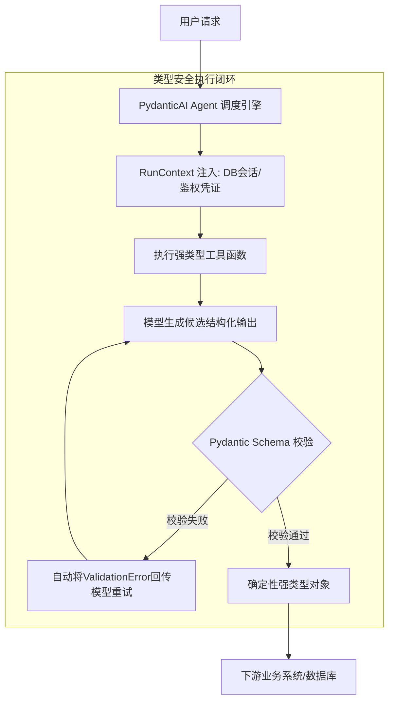

---
tags:
  - ai-practice
  - engineering
  - agent-architecture
  - type-safety
domain: Agent设计与结构化输出
difficulty: 中等
date_added: 2026-09-21
---

# 💡 基于 PydanticAI 的类型安全 Agent 架构设计与结构化输出实践

> **核心摘要**：大模型生成的不确定性是阻碍 Agent 走向工业级生产的最大瓶颈。本文结合 PydanticAI 框架，介绍如何通过“Schema 驱动 + 运行时依赖注入 + 校验失败自反思（Self-Correction）”，彻底消除 JSON 幻觉与类型崩溃，构建高弹性的强类型智能体系统。

---

## 🎯 业务/技术背景与痛点

在企业级后端系统中，AI Agent 通常处于关键业务链路上，例如：
1. **下游系统强依赖确定性 Schema**：如果下游是数据库写入、消息队列消费或执行扣款 API，大模型一旦漏掉一个必填字段、类型错误（如字符串变成列表）或产生非法枚举，整个流水线瞬间宕机。
2. **传统 Prompt 约束脆弱**：即便在提示词中反复强调“请只输出标准 JSON，不要有任何 Markdown 标记”，模型仍有 2%~5% 概率包含 ` ```json ` 标签或产生注释字符。
3. **工具调用与上下文状态耦合混乱**：常规做法使用全局变量传递数据库连接和鉴权信息，导致多协程并发下上下文冲突，难以编写自动化单元测试。

---

## 🏗️ 架构设计与解决方案

采用 **“类型定义即协议”** 的工程架构：



### 核心机制：
1. **Schema 闭环约束**：利用大模型原生的 `response_format / tools` 协议，以 Pydantic V2 BaseModel 作为严格契约。
2. **校验自愈重试（Self-Correcting Loop）**：当输出不合规时，框架自动将 Pydantic 抛出的精细化 `ValidationError`（包含具体字段与原因）作为 User 提示再次提交给大模型，模型在第二次推理中自我修正。
3. **依赖解耦注入（Dependency Injection）**：所有非确定性外部依赖（网络连接、配置、Token）均通过 `RunContext` 显式注入，保证工具函数本身为纯净的确定性逻辑。

---

## 💻 关键落地代码与配置

```python
from dataclasses import dataclass
from typing import List, Optional
from enum import Enum
import httpx
from pydantic import BaseModel, Field, field_validator
from pydantic_ai import Agent, RunContext, ModelRetry

# 1. 严格业务输出协议定义
class SeverityEnum(str, Enum):
    LOW = "low"
    MEDIUM = "medium"
    HIGH = "high"
    CRITICAL = "critical"

class SecurityVulnerability(BaseModel):
    cve_id: Optional[str] = Field(None, description="CVE 编号，如 CVE-2024-XXXX")
    package_name: str = Field(..., description="受影响的代码包或组件名")
    severity: SeverityEnum = Field(..., description="危害评级")
    cvss_score: float = Field(..., ge=0.0, le=10.0, description="CVSS 基础分数 0.0~10.0")
    remediation: str = Field(..., description="官方修复与升级建议")

    @field_validator("cvss_score")
    @classmethod
    def validate_score_severity_consistency(cls, v, info):
        # 自定义业务校验逻辑
        severity = info.data.get("severity")
        if severity == SeverityEnum.CRITICAL and v < 9.0:
            raise ValueError("严重度为 CRITICAL 时，CVSS 分数必须大于等于 9.0")
        return v

class AuditReport(BaseModel):
    repo_name: str
    vulnerabilities: List[SecurityVulnerability]
    is_safe_to_deploy: bool
    summary: str

# 2. 运行时依赖定义
@dataclass
class AuditDeps:
    client: httpx.AsyncClient
    internal_token: str

# 3. 构建 Agent
security_agent = Agent(
    model="openai:gpt-4o",
    result_type=AuditReport,
    deps_type=AuditDeps,
    retries=3, # 校验失败最多自动反思重试 3 次
    system_prompt="你是一名严谨的企业级代码安全审计专家，请结合工具扫描结果输出最终审计报告。"
)

# 4. 强类型工具实现
@security_agent.tool
async def scan_dependency_tree(ctx: RunContext[AuditDeps], project_name: str) -> dict:
    """调用内部安全网关获取项目依赖树"""
    # 依靠类型提示自动被 PydanticAI 转化为 tool schema
    headers = {"X-Audit-Token": ctx.deps.internal_token}
    # 模拟真实网络请求
    return {
        "status": "success",
        "packages": [
            {"name": "log4j", "version": "2.14.0", "vulnerability": "Remote Code Execution"}
        ]
    }
```

---

## ⚠️ 生产环境避坑指南

1. **避免在 BaseModel 中使用过度复杂的嵌套动态字典 (`dict[str, Any]`)**：
   - 动态字典会导致大模型失去 Schema 引导，降低字段输出的准确率。尽可能将字段明确拆分为子 Model。
2. **善用 `ModelRetry` 主动抛出引导异常**：
   - 如果工具函数或验证器检测到数据虽然符合基本类型、但不符合特定业务逻辑，不要返回空值，直接 `raise ModelRetry("提示模型缺失的具体信息")`，大模型会自动感知并在下一步纠偏。
3. **利用 Field(description=...) 提供微提示**：
   - 每个字段的 `description` 实际上就是该字段的局部 Prompt。对于枚举或特殊格式（如 ISO 8601 时间戳、SemVer 版本号），务必在 description 中给出格式样例。

---

## 🔗 关联项目与引用
- 核心工具卡片：[[PydanticAI]]
- 监控与追踪卡片：[[Langfuse]]
- 关联日报：[[2026-09-21-AI-Digest]]
