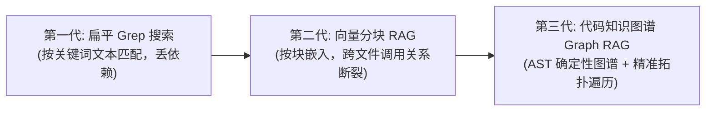
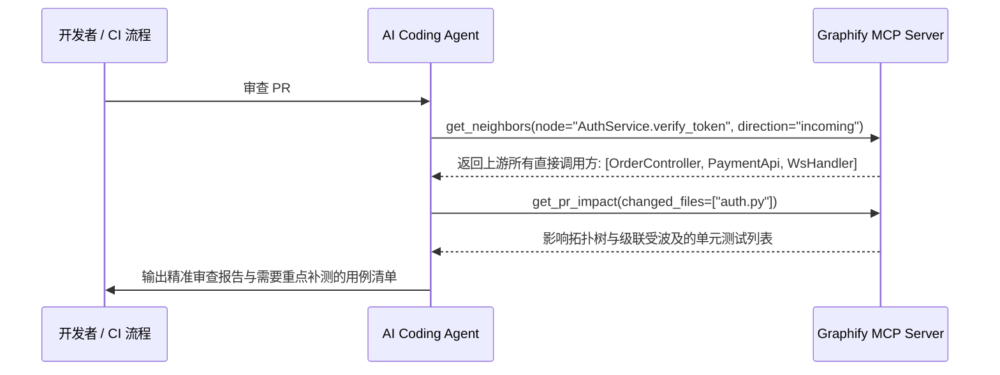

---
tags:
  - ai-practice
  - code-intelligence
  - graph-rag
  - architecture
domain: 代码智能与上下文编排
difficulty: 进阶
date_added: 2026-09-21
---

# 💡 基于代码知识图谱的 AI 辅助编程：Graphify 架构与落地

> **核心摘要**：传统代码 RAG 使用向量切块经常割裂调用链。通过引入 AST 静态解析与知识图谱（Code Knowledge Graph），结合 BFS/DFS 邻居展开，实现超低 Token 消耗下的精准跨文件依赖感知与改动影响面评估。

---

## 🎯 痛点与背景：AI 读代码的三代演进

1. **向量搜索在代码领域的天然水土不服**：
   - 自然语言文章句子之间是连续的；而代码是**高度网状互联**的（接口与实现分离、依赖注入、跨模块导入）。
   - 如果一个函数调用了另一个模块的 3 个函数，向量检索往往只能召回定义该函数的代码块，却召回不了它依赖的下游实现，导致大模型生成代码时频繁产生“幻觉参数”或“类型错误”。
2. **知识图谱的破局点**：
   - 节点（Node）：文件、类、函数、变量、接口。
   - 边（Edge）：`calls`（调用）、`imports`（导入）、`inherits`（继承）、`implements`（实现）。

---

## 🏗️ 核心架构与遍历机制

### 1. BFS 广度优先（Broad Context）vs DFS 深度优先（Trace Path）

当向 AI 询问一个具体代码问题时，Graphify 提供了两种图遍历策略：

- **BFS 广度优先（默认推荐）**：
  - 以目标节点为中心，向外扩散 1~2 层邻居。
  - **用途**：收集该函数所有直接调用的方法签名与入参类型，构筑完整的执行上下文边界。
- **DFS 深度优先**：
  - 沿着单条链路一扎到底。
  - **用途**：追踪“API 请求从路由层 -> 中间件 -> 控制器 -> 服务层 -> 数据库 DAO”的完整端到端生命周期调用栈。

### 2. 上帝节点（God Nodes）分析与架构防护
在任何大型项目中，都会有一些被成百上千个模块依赖的核心基础组件（如 `utils.py`、`BaseEntity`、`ApiClient`）。
- **痛点**：修改上帝节点极易导致全局崩溃。
- **解法**：通过 `god_nodes` 算法计算每个节点的出入度，提示 AI 在修改核心中枢时必须采取更加严谨的兼容性设计与防御性编程。

---

## 💻 实践场景：利用 MCP 工具实现自动 PR 影响面分析 (Impact Analysis)

当在 Git 中改动了某段核心业务逻辑时，过去只能靠人工经验去猜测“哪些外部模块受影响”。现在可以通过 Graphify MCP 工具链自动化审查：

---

## ⚠️ 落地最佳实践与避坑点

1. **Token Budget 剪枝控制**：
   - 知识图谱遍历如果深度设得过大（如 `depth=5`），召回的节点很容易膨胀。
   - **最佳实践**：检索深度限制在 `depth=2` 或 `depth=3`，设置 `token_budget=2000`，只召回函数签名与接口定义，不展开所有下游函数体。
2. **与 Git Hook 联动**：
   - 可以在 `.git/hooks/pre-push` 或 CI 流水线中自动执行 `graphify init`，保证 `graph.json` 永远与最新代码分支保持绝对同步。

---

## 🔗 关联阅读
- 开源工具：[[Graphify]], [[FastMCP]]
- 知识库导航：[[000-AI-Index]]
