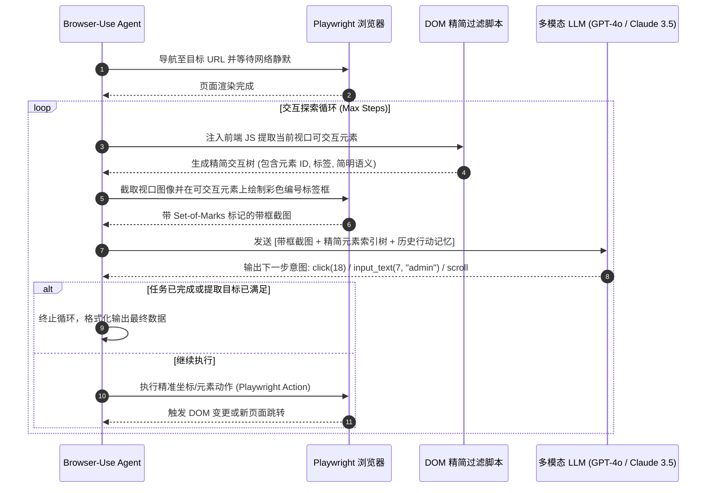

---
tags:
  - ai-practice
  - engineering
  - agent-architecture
  - web-agent
domain: Agent设计与网页自动化
difficulty: 中等
date_added: 2026-09-22
---

# 💡 多模态网页自动化：基于 Browser-Use 的视觉驱动 Agent 设计与工程避坑

> **核心摘要**：传统的网页爬虫和自动化脚本深陷“选择器极易脆断”与“无法处理复杂富交互 SPA”的泥潭；而直接将庞杂 HTML 丢给大模型又面临灾难级的 Token 膨胀与高延迟。本文结合开源标杆 `Browser-Use`，系统解析“视觉标记（Set-of-Marks）+ 紧凑交互 DOM 投影”的双重感知架构，并总结在真实生产环境中的高频踩坑点与避坑策略。

---

## 🎯 业务痛点：传统自动化与朴素 LLM 方案为何屡屡碰壁？

在日常企业业务流转中，存在大量缺乏开放 API 的外部系统（如第三方 SaaS 门户、供应商后台、各级申报平台）。开发人员试图对其进行自动化操作时，往往遇到以下硬伤：

1. **DOM 选择器极度脆弱（Brittle Selectors）**：
   - 现代前端广泛采用 CSS Modules、Tailwind 或混淆打包，类名如 `.btn-v2_8f29` 在每次前端发版后彻底变动，导致基于 XPath / CSS Selector 的脚本频繁挂掉，维护成本极其高昂。
2. **HTML 上下文灾难性膨胀（DOM Bloat & Token Exhaustion）**：
   - 现代单页应用（SPA）充满海量的 SVG、CSS、嵌套 `<div>` 和脚本标签，完整页面的 HTML 往往高达数百 KB 甚至数 MB，若直接塞给 LLM 会瞬间击穿上下文窗口，带来数十秒的延迟和高昂费用。
3. **动态渲染与交互时序问题（Hydration & Dynamic States）**：
   - 骨架屏、下拉无限滚动、懒加载与局部刷新使得静态无头爬虫无法抓取到真实渲染后的元素，容易引发元素不可见异常（ElementNotInteractable）。

---

## 🏗️ 架构设计与解决方案

基于 `Browser-Use` 构建的下一代多模态网页智能体，采用 **“观察 - 压缩映射 - 视觉决策 - 动作执行”** 的闭环控制流：



### 核心技术要点

1. **精简交互 DOM 投影（Interactive-only DOM Filtering）**：
   - 仅保留原生交互标签（`<a>`, `<button>`, `<input>`, `<select>`, `<textarea>`）以及绑定了 `onclick` 或 `cursor: pointer` 的元素；
   - 剥离所有内联样式、内联脚本、冗余 class 属性，仅保留标签文本、placeholder、aria-label 和全局唯一自增序号 `[1], [2], ...`。
   - 上下文体积由数万 Token 骤降至 300~800 Token，降低 90%+ 成本。
2. **视觉坐标锚定（Visual Grounding with Bounding Boxes）**：
   - 多模态模型结合直观截图与对应标签序号，能有效识别模态弹窗、遮罩层与视觉上最突出的主按钮，规避了由于 CSS 隐藏导致的隐形元素误点。
3. **动作空间约束（Constrained Action Space）**：
   - 模型仅允许输出标准化动作原语：`click(index)`, `type(index, text)`, `scroll_down()`, `open_new_tab(url)`, `go_back()`, `press_key(key)`，保证执行链条完全受控。

---

## 💻 关键工程实现代码

以下为一个生产级多模态网页自动化脚本示例，演示如何配置无头抗检测环境、挂载自定义数据持久化动作并设置执行安全护栏：

```python
import asyncio
import os
from browser_use import Agent, Controller, BrowserConfig
from browser_use.browser.browser import Browser
from langchain_openai import ChatOpenAI
from pydantic import BaseModel, Field

# 1. 定义最终结构化返回数据契约
class TargetDataSchema(BaseModel):
    title: str = Field(description="页面核心主题或卡片名称")
    stars: str = Field(description="GitHub Star 数或热度指标")
    summary: str = Field(description="核心亮点总结")

# 2. 初始化带业务动作的 Controller
controller = Controller(output_model=TargetDataSchema)

@controller.action("向本地监控日志写入重要进度")
def write_audit_log(step_desc: str):
    print(f"[审计日志] {step_desc}")
    return "日志记录完成"

async def run_resilient_web_agent():
    # 3. 生产级浏览器配置：注入抗检测参数与视口尺寸
    browser = Browser(
        config=BrowserConfig(
            headless=True,                 # 无头模式适配 Linux 服务器
            disable_security=False,
            extra_chromium_args=[
                "--disable-blink-features=AutomationControlled",
                "--window-size=1280,900"
            ]
        )
    )

    # 4. 构建 Agent 实例并绑定 GPT-4o 视觉能力
    agent = Agent(
        task="打开 https://github.com/trending，寻找榜首开源项目，记录其项目名、Star 数与简介",
        llm=ChatOpenAI(model="gpt-4o", temperature=0.0),
        browser=browser,
        controller=controller,
        use_vision=True,                   # 开启视觉定位
        max_failures=3,                    # 最大容错重试次数
        retry_delay=2                      # 失败重试等待间隔 (秒)
    )

    print("🚀 启动 Browser-Use Agent 自动化流程...")
    history = await agent.run(max_steps=12)
    
    # 获取结构化抽取结果
    final_data = history.final_result()
    print("\n✅ 自动化执行圆满成功！提取结果：\n", final_data)

if __name__ == "__main__":
    asyncio.run(run_resilient_web_agent())
```

---

## ⚠️ 生产环境高频踩坑与避坑指南

### 1. 动态水合（Hydration）与网络延迟竞态问题
- **坑点**：无头浏览器刚触发 `load` 事件，页面中的 Vue/React 前端框架尚未完成组件水合或接口请求未返回，Agent 截图并点击导致无效或报错。
- **避坑方案**：
  - 在动作执行器中增加 `page.wait_for_load_state("networkidle")` 强制等待网络静止；
  - 针对高频异步区域增加轻量自旋重试（Spin-Wait），若点击后页面状态无实质改变，主动向大模型报错并重试。

### 2. 弹窗与遮罩层导致的目标遮挡（Overlay Blocking）
- **坑点**：现代网站普遍弹出 Cookie 同意声明、订阅通知或浮层广告，物理遮挡了主屏幕的输入框或提交按钮，导致点击穿透报错。
- **避坑方案**：
  - 在 Agent System Prompt 中加入**最高优先级防呆准则**：“若视口出现遮罩或弹窗（如 Cookie Consent / Close 按钮），必须先将其关闭方可执行后续操作”。

### 3. 长链路会话中的 Token 成本失控与死循环
- **坑点**：当遇到未预料的页面流向时，Agent 容易陷入“点击 A -> 没变化 -> 再次点击 A”的无效死循环，连续消耗高昂的多模态 API 费用。
- **避坑方案**：
  - **强制设定 `max_steps`（通常 10~15 步即可完成绝大部分单点任务）**；
  - 维护最近 3 次动作的哈希签名列表，若检测到连续 2 次出现完全相同的动作决策，强制注入警告 Prompt 促使其更换路径或主动上报失败。

### 4. 账号登录态与敏感凭证防护
- **坑点**：在提示词中直接下发明文密码容易在 Tracing 平台（如 Langfuse）和日志中泄漏；每次重启无头实例导致验证码频发。
- **避坑方案**：
  - 本地挂载 Chrome `user_data_dir` 持久化 Profile，复用已人工登录好的 Session/Cookies；
  - 敏感凭据统一通过 Controller 在本地注入，禁止直接通过 Prompt 明文传输给公有云大模型。

---

## 🔗 关联项目与引用
- 相关开源工具：[[Browser-Use]], [[smolagents]], [[Pi-Agent]]
- 关联架构实践：[[代码驱动智能体：基于 CodeAgent 的复杂多步任务执行范式]], [[Agent 生产级可观测性与评估：基于 Langfuse 的全链路追踪实践]]
- 参考开源：[browser-use/browser-use GitHub 官方仓库](https://github.com/browser-use/browser-use)
