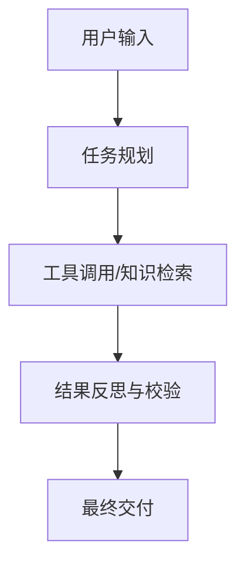

---
tags:
  - ai-practice
  - engineering
  - architecture
domain: "" # 候选值: Agent设计, RAG调优, Prompt工程, 模型微调, 本地部署加速, 上下文管理
difficulty: "中等" # 候选值: 入门, 中等, 进阶
date_added: {{date}}
---

# 💡 {{title}}

> **核心摘要**：一两句话总结本实践的核心方法或设计模式。

---

## 🎯 业务/技术背景与痛点
- **面临的问题**：在传统实现中通常遇到什么瓶颈（如幻觉、长文本丢失、推理延迟高、并发限制等）？
- **优化目标**：期望达到的指标或体验。

---

## 🏗️ 架构设计与解决方案
- **核心逻辑**：
- **流程图/时序图**（如有）：


---

## 💻 关键代码 / 配置 / Prompt 模板

```python
# 关键实现代码片段
```

---

## ⚠️ 生产环境踩坑与避坑指南
1. **坑点 1**：...
   - **避坑方案**：...
2. **坑点 2**：...
   - **避坑方案**：...

---

## 🔗 关联项目与引用
- 相关工具: [[相关开源工具]]
- 参考资料 / 原文链接:
